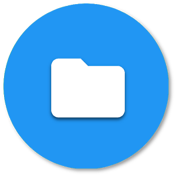

<h2 align="center">Project Title</h2>

<p align="center">
   
</p>
<p align="center">
  <a href="https://github.com/sandip2224/My-README.md-Template"><strong>Explore the docs »</strong></a>
</p>
<!-- PROJECT LOGO -->
  <p align="center">
    <br />
    <a href="https://github.com/sandip2224/My-README.md-Template">View Demo</a>
    ·
    <a href="https://github.com/sandip2224/My-README.md-Template/issues">Report Bug</a>
    ·
    <a href="https://github.com/sandip2224/My-README.md-Template/issues">Request Feature</a>
  </p>

<!-- TABLE OF CONTENTS -->
<h2 align="center">Table of Contents</h2>

- [About the Project](#about-the-project)
   - [Project Preview](#project-preview)
   - [Built With](#built-with)
- [Getting Started](#getting-started)
   - [Core Folder Structure](#folder-structure)
   - [Installation](#installation)
- [Usage](#usage)
- [License](#license)
- [Contributing](#contributing)
- [Contact](#contact)
- [Acknowledgements](#acknowledgements)

<!-- ABOUT THE PROJECT -->

<h2 align="center">About the Project</h2>

> There are a lot of README templates out there on GitHub, but however, most of them didn't align with my needs and so I created this personalized one. My intention was to create  README.md template that you'll be able to use in most of your repositories with minimal modifications.  

Here's why it's so awesome:  

- ***You should focus on creating something amazing instead of worrying about a README.md that you might need to build from scratch.*** 😁  
- ***It's a template repository, so essentially you can just generate a README.md for your repository without problems.*** ✅  
- ***You shouldn't repeat the process of building a README.md again and again from scratch because you're awesome.*** 🖖  

<!-- Preview -->
<h2 align="center">Project Preview</h2>

<p align="center"></p>

<!-- BUILT WITH -->  

<h2 align="center">Built With</h2>

> This section should list any major frameworks that you built your project using either as `text` or as `badges`. Leave any add-ons/plugins for the acknowledgements section. Here are a few examples.  

<p align="center">
   
   
   
   
   
</p>  

<!-- INSTALLATION -->
<h2 align="center">Installation</h2>

1. Fork and clone this repository using  

```
  git clone https://github.com/sandipan_2224/My-README.md-Template.git
  cd My-README.md-Template 
```  

2. Add required steps to get the project up and running.  

<!-- LICENSE -->  

<h2 align="center">License</h2>

Distributed under the MIT License. See `LICENSE` for more information.  

<!-- CONTRIBUTING -->
<h2 align="center">Contributing</h2>

Contributions are what make the open source community such an amazing place to be learn, inspire, and create. Any contributions you make are **greatly appreciated**.

1. Fork the Project
2. Create your Feature Branch (`git checkout -b feature/AmazingFeature`)
3. Commit your Changes (`git commit -m 'Add some AmazingFeature'`)
4. Push to the Branch (`git push origin feature/AmazingFeature`)
5. Open a Pull Request  

<!-- CONTACT --> 

<h2 align="center">Contact</h2>

- **Reach out to me at** [ sandipan2224@gmail.com](sandipan2224@gmail.com)  

<p align="right"><a href="#table-of-contents">🔼 Back to top</a></p>
